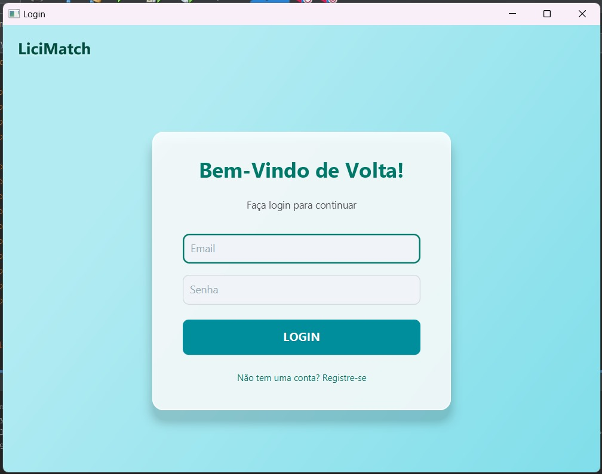
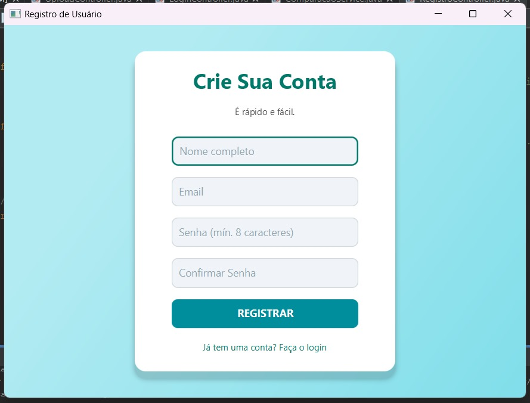
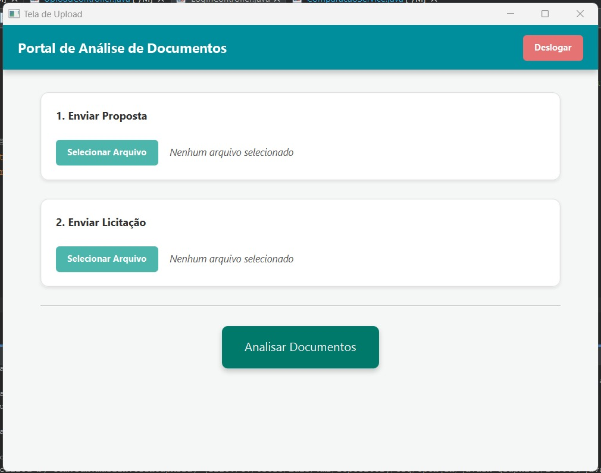

# LiciMatch (SCdL) 📄⚖️


> Uma aplicação desktop inteligente para otimizar o processo de análise de licitações, utilizando IA para comparar documentos PDF e extrair insights valiosos.

O LiciMatch foi desenvolvido para combater a burocracia e a complexidade do sistema de licitações. A ferramenta permite que o usuário faça o upload de um documento de licitação e de uma proposta concorrente. Em seguida, uma API de Inteligência Artificial processa ambos os documentos, realizando uma análise comparativa detalhada e gerando um relatório com semelhanças, diferenças e uma nota de compatibilidade.

---

## ✨ Funcionalidades Principais

- **Autenticação de Usuário:** Sistema seguro de login e registro com criptografia de senhas.
- **Upload de Documentos:** Interface intuitiva para upload de arquivos de Licitação e Proposta em formato PDF.
- **Persistência de Dados:** Armazenamento seguro de usuários e documentos em um banco de dados MySQL.
- **Análise com IA:** Integração com a API da OpenRouter para extrair texto dos PDFs e realizar uma comparação analítica.
- **Visualização de Resultados:** Tela dedicada para exibir o resultado da comparação, incluindo nota, pontos similares e divergentes.
- **Design Moderno:** Interface gráfica desenvolvida em JavaFX com um design limpo, consistente e agradável.

## 📸 Screenshots

<table>
  <tr>
    <td align="center"><strong>Tela de Login</strong></td>
    <td align="center"><strong>Tela de Registro</strong></td>
    <td align="center"><strong>Tela de Upload</strong></td>
    <td align="center"><strong>Tela de Resultados</strong></td>
  </tr>
  <tr>
    <td></td>
    <td></td>
    <td></td>
    <td></td>
  </tr>
</table>

## 🛠️ Tecnologias Utilizadas

Este projeto foi construído utilizando as seguintes tecnologias e frameworks:

- **Linguagem:** Java 21
- **Interface Gráfica:** JavaFX
- **Gerenciamento de Projeto:** Apache Maven
- **Banco de Dados:** MySQL
- **Conector JDBC:** `mysql-connector-j`
- **Análise de PDF:** Apache PDFBox
- **Criptografia de Senhas:** jBCrypt
- **Comunicação com API:** Java 11+ HTTP Client
- **Processamento de JSON:** Gson
- **API de IA:** [OpenRouter.ai](https://openrouter.ai/) (utilizando o modelo `openai/gpt-3.5-turbo`)

## 🏛️ Arquitetura do Projeto

O sistema foi desenvolvido seguindo padrões de projeto modernos para garantir organização, manutenibilidade e escalabilidade:

- **MVC (Model-View-Controller):** Para a separação clara entre a interface gráfica (View), o controle de eventos (Controller) e os dados (Model).
- **DAO (Data Access Object):** Para abstrair e encapsular todo o acesso ao banco de dados, separando a lógica de negócio da persistência de dados.
- **Camada de Serviço (Service Layer):** Atua como intermediária entre os Controllers e os DAOs, contendo as regras de negócio do sistema (ex: criptografar senha, validar dados antes de salvar).
- **Singleton:** Utilizado para gerenciar a conexão com o banco de dados (`ConnectionFactory`) e a sessão do usuário (`UserSession`), garantindo uma única instância e economizando recursos.

## 🚀 Como Executar o Projeto

Antes de começar, verifique se você atendeu aos seguintes requisitos:

- **JDK 21 ou superior** instalado e configurado.
- **Apache Maven** instalado e configurado nas variáveis de ambiente.
- **Servidor MySQL** em execução (via XAMPP, WAMP, Docker, etc.).
- **Git** instalado.

Siga estas etapas para executar o projeto localmente:

1.  **Clone o repositório:**
    ```bash
    git clone [https://github.com/LMSolera/SCdL.git](https://github.com/LMSolera/SCdL.git)
    cd SCdL
    ```

2.  **Configure o Banco de Dados:**
    - Crie um novo banco de dados no seu servidor MySQL com o nome `scdl`.
    - Execute o script SQL localizado em `[CAMINHO_DO_SEU_SCRIPT_SQL]` para criar todas as tabelas necessárias.

3.  **Configure a Conexão:**
    - Navegue até `src/main/resources/`.
    - Renomeie o arquivo `database.properties.example` para `database.properties`.
    - Abra o arquivo `database.properties` e ajuste os valores de `db.url`, `db.user` e `db.password` de acordo com a configuração do seu servidor MySQL.

4.  **Configure a Chave da API:**
    - Navegue até a classe `com.lpn3.licitamatch.controller.APIConnection.java`.
    - Substitua o valor da variável `openRouterApiKey` pela sua chave pessoal da OpenRouter.

5.  **Execute com o Maven:**
    Abra um terminal na pasta raiz do projeto e execute o seguinte comando:
    ```bash
    mvn clean javafx:run
    ```

## 📫 Contribuindo para o LiciMatch

Para contribuir com o LiciMatch, siga estas etapas:

1.  Faça um "fork" deste repositório.
2.  Crie um novo branch: `git checkout -b minha-nova-feature`.
3.  Faça suas alterações e confirme-as: `git commit -m 'feat: Adiciona minha nova feature'`.
4.  Envie para o seu branch no seu fork: `git push origin minha-nova-feature`.
5.  Crie um Pull Request.

Como alternativa, consulte a documentação do GitHub em [como criar uma solicitação pull](https://help.github.com/en/github/collaborating-with-issues-and-pull-requests/creating-a-pull-request).

## 🤝 Colaboradores

Agradecemos às seguintes pessoas que contribuíram para este projeto:

<table>
  <tr>
    <td align="center">
      <a href="https://github.com/henrique-username-aqui" title="Henrique Duarte">
        <br>
        <sub>
          <b>Henrique Duarte</b>
        </sub>
      </a>
    </td>
    <td align="center">
      <a href="https://github.com/luismiguel-username-aqui" title="Luis Miguel">
        <br>
        <sub>
          <b>Luis Miguel</b>
        </sub>
      </a>
    </td>
  </tr>
</table>

## 📝 Licença

Este projeto está sob a licença Apache 2.0. Veja o arquivo [LICENSE](LICENSE.md) para mais detalhes.
